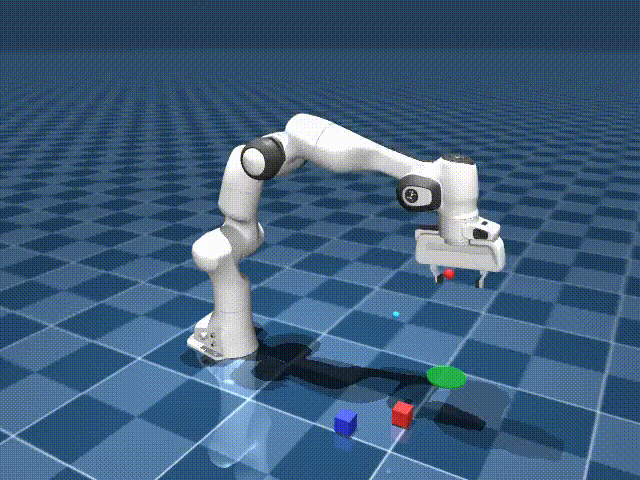
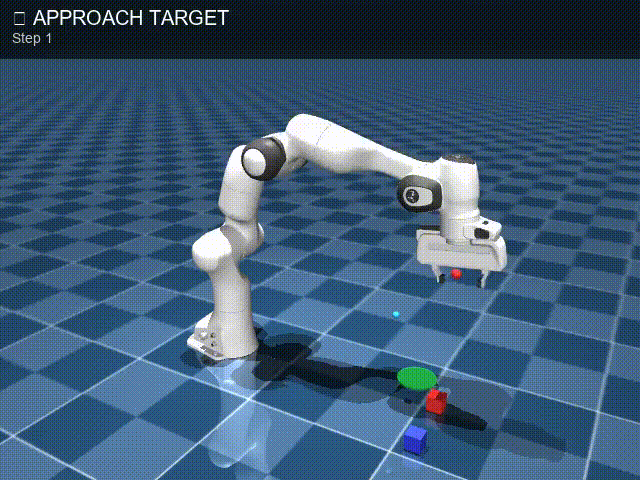

# Mujoco LLM Task Abstraction

Language-Guided Task Abstraction for Robotic Manipulation in MuJoCo with Franka Panda.

## Demo: Inverse Kinematics vs LLM-Driven Execution

<table>
<tr>
<th> Inverse Kinematics Demo (baseline)</th>
<th> LLM Task Graph Execution</th>
</tr>
<tr>
<td></td>
<td></td>
</tr>
<tr>
<td>Scripted IK controller executing a <b>fixed trajectory</b>: positions are hardcoded at compile time.</td>
<td>Gemini 2.5 Flash generates a task graph from noisy segmentation: the robot <b>generalizes to unseen layouts</b>.</td>
</tr>
</table>

### Current status

- Environment core with EE-first controller (damped least-squares IK, 200 Hz control loop)
- Rule-based segmentation: 7 primitive types extracted from raw trajectories
- LLM task-graph generation via Gemini 2.5 Flash: JSON schema validation, 3-retry with exponential backoff, deterministic fallback
- Execution engine: 7 node handlers with dynamic sub-goals, grasp retry (up to 3 times), safety timeouts
- Video recording with real-time node overlay (PIL text rendering at capture time)
- Evaluation on 10 seeds: **80% success** (abstraction) vs 70% (baseline), **100% grasp rate** vs 90%, mean placement error 0.132 vs 0.203

## Requirements

- Python 3.10+
- `uv` already configured
- Franka Menagerie assets already present in `mujoco_env/assets/franka_emika_panda/`

## Install dependencies

```bash
uv sync
```

## Run smoke environment

Headless:

```bash
uv run mujoco-env-smoke --headless --steps 50 --seed 0 --output-dir artifacts/smoke
```

Render (interactive inspection):

```bash
uv run mujoco-env-smoke --render --steps 200 --seed 0 --output-dir artifacts/render
```

## Collect scripted demos

```bash
uv run collect-demos --headless --episodes 5 --steps 220 --seed 0 --output-dir artifacts/demos --dataset-path demos/dataset.pkl
```

Optional video output:

```bash
uv run collect-demos --render --episodes 1 --steps 220 --seed 0 --save-mp4 --output-dir artifacts/demos --dataset-path demos/dataset.pkl
```

## Controller details

The project uses an `EE-first` controller:
- Command format is Cartesian EE target + gripper flag: `[ee_x, ee_y, ee_z, gripper_closed]`.
- The controller computes arm joint targets (`joint1..joint7`) with IK and writes them to MuJoCo position actuators.

IK is solved with damped least squares (DLS):

```text
dq = J^T (J J^T + lambda^2 I)^(-1) e
```

Where:
- `J` is the site Jacobian of the gripper (`mj_jacSite`).
- `e` is Cartesian position error (orientation term optional and currently disabled by default).
- `lambda` is damping for numerical stability near singularities.

Stability safeguards:
- Joint delta clipping per step (`max_delta_q`).
- Joint-limit clipping.
- EE target rate limiting in `env.step` to avoid impulsive commands.

## Grasp model (`weld`)

Contacts alone can be unstable in early development, so grasp is simplified with a runtime MuJoCo `equality/weld`:
- `close` + finger contact with target + near-distance condition -> weld attaches target to hand.
- `open` -> weld detaches.
- Failsafe detach if weld is active but EE-target distance diverges.

Important implementation detail:
- Before enabling weld, relative pose is written to weld `eq_data` (rel position + rel quaternion) to prevent teleport/impulsive jumps.

## Segmentation — Rule-Based Primitive Detection

The segmentation module (`segmentation/segment.py`) takes a raw trajectory (list of observation dicts from `collect_demos.py`) and labels each timestep with a **primitive** — a high-level description of what the robot is doing at that moment. Consecutive steps with the same label are merged into segments.

```bash
uv run segment-dataset --input demos/dataset.pkl --output artifacts/segments.json
```

### Primitive Table

Each timestep is classified by checking these rules **in order** (first match wins):

| Primitive | Condition | Meaning |
|-----------|-----------|---------|
| `open_gripper` | Gripper just opened AND `target_goal_dist ≤ 0.07` | Releasing the cube in the goal region |
| `approach` | Gripper open AND `ee_target_dist > 0.10` AND no contact | EE moving toward the cube from above |
| `lower` | Gripper open AND `ee_target_dist ≤ 0.10` AND `target_z < 0.065` | EE descending to grasp height |
| `close_gripper` | Gripper closed AND (finger contact OR weld active) AND `target_z < 0.065` | Fingers squeezing the cube |
| `move_to_goal` | Gripper closed AND `target_z ≥ 0.065` AND `goal_progress > 0.004` | Cube in hand, moving toward goal |
| `lift` | Gripper closed AND `target_z ≥ 0.065` | Cube in hand, being raised (not yet approaching goal) |
| `stabilize` | None of the above | Fallback — robot idle or in transition |

### Key Variables

- **`ee_target_dist`**: Euclidean distance between end-effector and target cube.
- **`target_goal_dist`**: Euclidean distance between target cube and goal region.
- **`target_z`**: Cube height — distinguishes "on floor" vs "lifted".
- **`goal_progress`**: `prev_goal_dist − current_goal_dist` — how much the cube got closer to the goal in the last step.
- **`gripper_closed`** / **`attached`**: Gripper command state and weld constraint state.

### Example Output

```json
[
  {"primitive": "approach",      "start": 0,  "end": 5,  "trigger": "ee_target_dist=0.23>0.10"},
  {"primitive": "lower",         "start": 6,  "end": 12, "trigger": "ee_target_dist=0.08<=0.10"},
  {"primitive": "close_gripper", "start": 13, "end": 15, "trigger": "contact=True"},
  {"primitive": "lift",          "start": 16, "end": 22, "trigger": "target_height=0.12>=0.065"},
  {"primitive": "move_to_goal",  "start": 23, "end": 30, "trigger": "goal_progress=0.012>0.004"},
  {"primitive": "open_gripper",  "start": 31, "end": 33, "trigger": "target_goal_dist=0.04<=0.07"}
]
```

Each segment includes the `trigger` string for debugging — it shows exactly which condition fired and with what values.

---

## LLM Abstraction — Task Graph Generation

The LLM abstraction module (`llm_abstraction/`) takes the primitive sequence from segmentation and converts it into a **task graph** — a structured JSON plan that can drive the execution engine.

### Full Pipeline

```text
dataset.pkl ──► segment.py ──► primitives ──► prompt.py ──► Gemini API ──► task_graph.json
                                                  │                            │
                                                  │    (if API fails)          │
                                                  └──► stub fallback ──────────┘
```

### Running

Offline deterministic fallback (no API key needed):

```bash
uv run generate-task-graph --segments-json artifacts/segments.json --output artifacts/task_graph.json
```

With Gemini API:

```bash
uv run generate-task-graph --segments-json artifacts/segments.json --output artifacts/task_graph.json --api-key-env GEMINI_API_KEY
```

### How It Works

**Step 1 — Prompt Construction** (`prompt.py`):
A prompt is built from the primitive sequence that instructs the LLM to:
- Return **strict JSON only**, no prose.
- Use **dynamic references** (`"env.target_pos"`, `"env.goal_pos"`) instead of hardcoded coordinates — so the same task graph works on any randomized layout.
- Preserve temporal ordering from the primitives.

**Step 2 — LLM Call or Fallback** (`generate_task_graph.py`):
- If `GEMINI_API_KEY` is set → calls Gemini (`gemini-2.5-flash` by default), extracts JSON from the response, validates it.
- If validation fails → **retries** up to 3 times with exponential backoff.
- If no API key or all retries fail → deterministic **stub fallback** that detects pick-and-place intent and emits the canonical 6-node task graph.

**Step 3 — Validation**:
The JSON is validated against a strict schema using **Pydantic** models:
- Every node must have `id`, `type` (one of the 7 valid types), and `params`.
- Every edge must have `from` and `to`.
- Pydantic parsing catches malformed responses.

### Task Graph Schema

```json
{
  "nodes": [
    {"id": "0", "type": "approach_target",  "params": {"target_ref": "env.target_pos"}},
    {"id": "1", "type": "lower_to_grasp",   "params": {"target_ref": "env.target_pos"}},
    {"id": "2", "type": "close_gripper",    "params": {}},
    {"id": "3", "type": "lift_target",      "params": {"target_ref": "env.target_pos"}},
    {"id": "4", "type": "move_to_goal",     "params": {"goal_ref": "env.goal_pos"}},
    {"id": "5", "type": "open_gripper",     "params": {"goal_ref": "env.goal_pos"}}
  ],
  "edges": [
    {"from": "0", "to": "1"},
    {"from": "1", "to": "2"},
    {"from": "2", "to": "3"},
    {"from": "3", "to": "4"},
    {"from": "4", "to": "5"}
  ],
  "metadata": {"generator": "gemini", "model_name": "gemini-2.5-flash"}
}
```

### Valid Node Types

| Node Type | Primitive Source | Description |
|-----------|----------------|-------------|
| `approach_target` | `approach` | Move EE above the target cube |
| `lower_to_grasp` | `lower` | Descend to grasp height |
| `close_gripper` | `close_gripper` | Close fingers and activate weld |
| `lift_target` | `lift` | Lift the grasped cube |
| `move_to_goal` | `move_to_goal` | Transport cube to goal region |
| `open_gripper` | `open_gripper` | Release cube at goal |
| `stabilize` | `stabilize` | Hold position (fallback) |

### Notes
- The API key is read from an environment variable (default: `GEMINI_API_KEY`).
- The value of the LLM is that Gemini can **deduplicate noisy primitives, correct ordering, and add missing nodes** (e.g. `open_gripper`). The deterministic fallback recognizes pick-and-place patterns and emits the correct canonical sequence.
- The stub fallback is always available for offline testing and CI.

---

## Execute from Task Graph

The execution engine interprets a task graph JSON and drives the environment with dynamic sub-goals.

```bash
uv run execute-task-graph --task-graph artifacts/task_graph.json --seed 0 --headless
```

With viewer:

```bash
uv run execute-task-graph --task-graph artifacts/task_graph.json --seed 0 --render
```

The engine executes each node sequentially, generating EE targets by reading `target_pos` and `goal_pos` from the live observation — no hardcoded positions. Each node has a safety timeout and the grasp node supports automatic retry.

---

## Evaluation Pipeline

Compare **baseline** (replay recorded actions from `dataset.pkl`) vs **abstraction** (task-graph execution) on the same seeds:

```bash
uv run evaluate --task-graph artifacts/task_graph.json --dataset demos/dataset.pkl --episodes 10 --seed 0 --headless
```

Output: console comparison table + `report.json` with per-episode results and aggregate metrics (success rate, mean steps, mean target-goal distance).

---

## Full Pipeline (end-to-end)

```bash
# 1. Collect demos
uv run collect-demos --headless --episodes 10 --steps 400 --seed 0 --dataset-path demos/dataset.pkl

# 2. Segment demos
uv run segment-dataset --input demos/dataset.pkl --output artifacts/segments.json

# 3. Generate task graph (offline fallback)
uv run generate-task-graph --segments-json artifacts/segments.json --output artifacts/task_graph.json

# 4. Execute from graph
uv run execute-task-graph --task-graph artifacts/task_graph.json --seed 0 --headless

# 5. Evaluate baseline vs abstraction
uv run evaluate --task-graph artifacts/task_graph.json --dataset demos/dataset.pkl --episodes 10 --seed 0 --headless
```

## Run tests

```bash
uv run pytest
```
